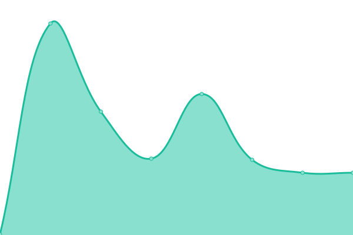
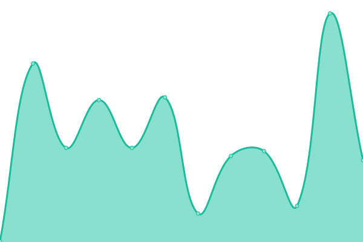

# [📈 Live Status](https://derrick-roach.github.io/microsoft-uptime): <!--live status--> **🟧 Partial outage**

This repository contains the open-source uptime monitor and status page for [a handful of Microsoft sites](https://derrick-roach.github.io/microsoft-uptime/), powered by [Upptime](https://github.com/upptime/upptime).

With [Upptime](https://upptime.js.org), you can get your own unlimited and free uptime monitor and status page, powered entirely by a GitHub repository. We use [Issues](https://github.com/derrick-roach/microsoft-uptime/issues) as incident reports, [Actions](https://github.com/derrick-roach/microsoft-uptime/actions) as uptime monitors, and [Pages](https://derrick-roach.github.io/microsoft-uptime) for the status page.

<!--start: status pages-->
<!-- This summary is generated by Upptime (https://github.com/upptime/upptime) -->
<!-- Do not edit this manually, your changes will be overwritten -->
<!-- prettier-ignore -->
| URL | Status | History | Response Time | Uptime |
| --- | ------ | ------- | ------------- | ------ |
|  [Microsoft.com](https://www.microsoft.com) | 🟥 Down | [microsoft-com.yml](https://github.com/derrick-roach/microsoft-uptime/commits/HEAD/history/microsoft-com.yml) | 

 12752ms
     
 | 

<a href="https://derrick-roach.github.io/microsoft-uptime/history/microsoft-com">95.31%</a>
    

|  [Bing](https://www.bing.com) | 🟩 Up | [bing.yml](https://github.com/derrick-roach/microsoft-uptime/commits/HEAD/history/bing.yml) | 

 86ms
     
 | 

<a href="https://derrick-roach.github.io/microsoft-uptime/history/bing">100.00%</a>
    

|  [Microsoft Copilot](https://copilot.microsoft.com) | 🟩 Up | [microsoft-copilot.yml](https://github.com/derrick-roach/microsoft-uptime/commits/HEAD/history/microsoft-copilot.yml) | 

 109ms
     
 | 

<a href="https://derrick-roach.github.io/microsoft-uptime/history/microsoft-copilot">100.00%</a>
    

|  [GitHub](https://github.com) | 🟩 Up | [git-hub.yml](https://github.com/derrick-roach/microsoft-uptime/commits/HEAD/history/git-hub.yml) | 

 167ms
     
 | 

<a href="https://derrick-roach.github.io/microsoft-uptime/history/git-hub">100.00%</a>
    

|  [LinkedIn](https://www.linkedin.com) | 🟩 Up | [linked-in.yml](https://github.com/derrick-roach/microsoft-uptime/commits/HEAD/history/linked-in.yml) | 

 227ms
     
 | 

<a href="https://derrick-roach.github.io/microsoft-uptime/history/linked-in">100.00%</a>
    

|  [Visual Studio](https://www.visualstudio.com) | 🟩 Up | [visual-studio.yml](https://github.com/derrick-roach/microsoft-uptime/commits/HEAD/history/visual-studio.yml) | 

 569ms
     
 | 

<a href="https://derrick-roach.github.io/microsoft-uptime/history/visual-studio">100.00%</a>
    

<!--end: status pages-->

[**Visit the status website →**](https://derrick-roach.github.io/microsoft-uptime)

## 📄 License

- Powered by: [Upptime](https://github.com/upptime/upptime)
- Code: [MIT](./LICENSE) © [Anand Chowdhary](https://anandchowdhary.com), supported by [Pabio](https://pabio.com)
- Data in the `./history` directory: [Open Database License](https://opendatacommons.org/licenses/odbl/1-0/)
